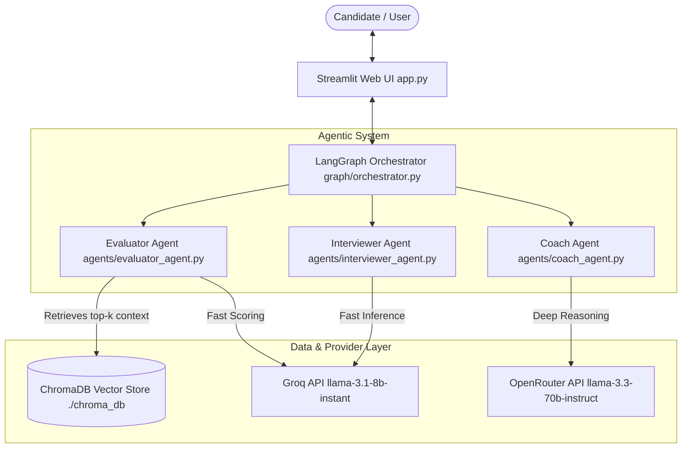
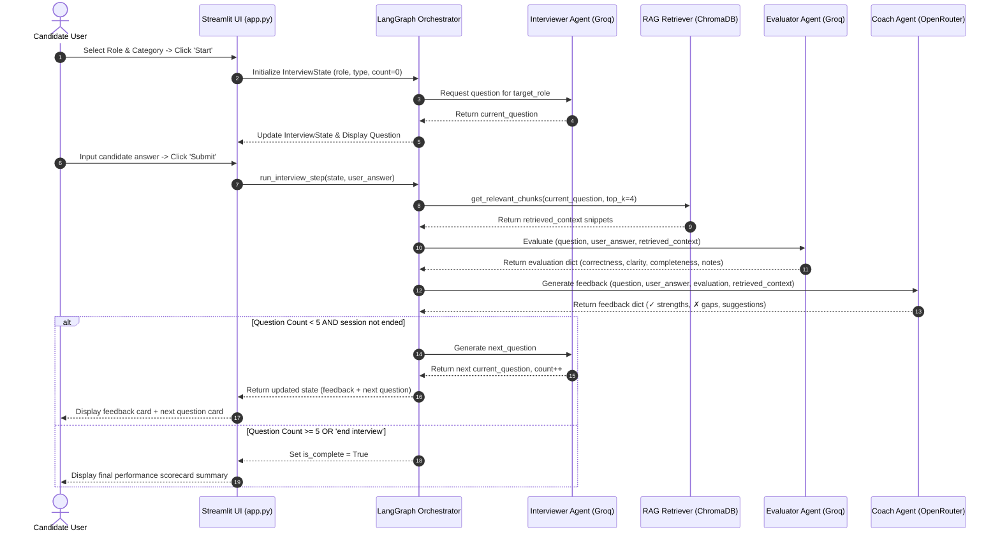

# 🎓 Interview Preparation Coach

An AI-powered multi-agent mock interview platform built for a university Agentic AI assignment. The system provides real-time candidate assessment, role-tailored question generation, and structured coaching feedback using **LangGraph orchestration**, **ChromaDB vector retrieval (RAG)**, **Groq API**, and **OpenRouter API**.

---

## 📌 Project Description

The **Interview Preparation Coach** simulates realistic job interview scenarios tailored to candidate-specified target roles (e.g., *Software Engineer*, *DevOps Engineer*, *Data Scientist*) and interview categories (*Technical*, *Behavioral*, *Coding*, *HR*). Rather than relying on static question lists, the platform dynamically coordinates three specialized AI agents working together in a stateful loop:

1. **Interviewer Agent**: Generates contextually relevant, role-specific questions.
2. **Evaluator Agent**: Retrieves domain knowledge rubrics from a local ChromaDB vector store and scores candidate answers across correctness, clarity, and completeness.
3. **Coach Agent**: Synthesizes response metrics and reference materials to deliver structured coaching recommendations formatted with clear strengths (`✓`) and actionable gaps (`✗`).

The application is built with Python 3.12, Streamlit, LangChain, Sentence Transformers (`all-MiniLM-L6-v2`), and LangGraph. It runs seamlessly in both local environments (`.env`) and cloud deployments (`st.secrets`).

---

## 🏗️ Architecture Diagram



---

## 🔄 Agent Communication Sequence Diagram



---

## ⚖️ Model Choice Comparison Table

| Sub-task / Agent | Provider & Model Name | Latency | Cost / 1M Tokens | Context Window | Reasoning Quality | Justification |
| :--- | :--- | :--- | :--- | :--- | :--- | :--- |
| **Interviewer Agent** (Question Gen & Routing) | **Groq** (`llama-3.1-8b-instant`) | ~250 ms | $0.05 / $0.08 | 128k | High (Fast) | Sub-second response latency ensures responsive conversational flow in Streamlit. |
| **Evaluator Agent** (Rubric Scoring) | **Groq** (`llama-3.1-8b-instant`) | ~300 ms | $0.05 / $0.08 | 128k | High | Rapid structured JSON scoring against retrieved RAG chunks. |
| **Coach Agent** (Reflection & Suggestions) | **OpenRouter** (`meta-llama/llama-3.3-70b-instruct`) | ~1.2 s | $0.12 / $0.30 | 128k | Superior Reasoning | 70B parameter model delivers deep pedagogical critique, structured formatting (`✓`/`✗`), and highly specific suggestions. |

---

## 📚 RAG Pipeline & Benchmark Retrieval Results

Knowledge documents live in `data/knowledge_base/` (`.txt` and `.pdf`). Ingestion uses `RecursiveCharacterTextSplitter` (`chunk_size=500`, `chunk_overlap=50`) and free local embeddings via `SentenceTransformerEmbeddingFunction` (`all-MiniLM-L6-v2`).

### 5 Benchmark Retrieval Evaluation Queries

| Benchmark Query | Top Retrieved Source | Key Retrieved Context Snippet | Relevance Rating |
| :--- | :--- | :--- | :--- |
| **"What is the STAR method?"** | `behavioral_prep.txt` | *STAR method: Situation, Task, Action, Result framework for behavioral questions...* | ⭐⭐⭐⭐⭐ (5/5) |
| **"Difference between abstract class and interface"** | `technical_prep.txt` | *Abstract Class represents 'is-a' relationship with state; Interface defines behavioral contracts...* | ⭐⭐⭐⭐⭐ (5/5) |
| **"How to answer 'tell me about a time you failed'"** | `behavioral_prep.txt` | *Take full ownership, avoid blaming external factors, highlight lessons learned...* | ⭐⭐⭐⭐⭐ (5/5) |
| **"Common DevOps interview questions"** | `devops_prep.txt` | *CI/CD pipelines, Docker containerization, Kubernetes orchestration, IaC Terraform...* | ⭐⭐⭐⭐⭐ (5/5) |
| **"How to solve a two-sum coding problem"** | `coding_prep.txt` | *Hash Map approach storing complement (target - num) achieving O(n) time complexity...* | ⭐⭐⭐⭐⭐ (5/5) |

---

## 🛠️ Setup & Execution Instructions

### Prerequisites
- Python 3.12+
- Git

### 1. Clone & Install Dependencies
```bash
git clone https://github.com/Janadari1213/interview-prep-coach.git
cd interview-prep-coach
python -m venv venv
# On Windows:
venv\Scripts\activate
# On Linux/macOS:
source venv/bin/activate

pip install -r requirements.txt
```

### 2. Configure Environment Variables
Copy `.env.example` to `.env` and insert your API keys:
```bash
cp .env.example .env
```
Edit `.env`:
```env
GROQ_API_KEY=your_actual_groq_api_key
OPENROUTER_API_KEY=your_actual_openrouter_api_key
```

### 3. Ingest Knowledge Base Documents
```bash
python rag/ingest.py
```

### 4. Run Benchmark Test Scripts (Optional)
```bash
# Test RAG retrieval
python scripts/test_retrieval.py

# Test full multi-agent pipeline
python scripts/test_full_flow.py
```

### 5. Launch Streamlit Application
```bash
streamlit run app.py
```

---

## 🌐 Live Demo
- **Live Demo**: `[add Streamlit Cloud URL after deployment]`

---

## ⚠️ Known Limitations

1. **Local Vector Persistence**: ChromaDB runs as a local persistent instance (`./chroma_db`). In serverless stateless environments, vector index rebuilds must be executed during app initialization.
2. **Speech & Audio Input**: Currently supports text-based answers. Future versions will integrate Whisper API for voice-to-text candidate responses.
3. **Session Length Boundary**: Sessions are currently scoped to 5 questions per interview turn to keep university demo evaluation focused and quota-efficient.
4. **Offline Mode**: Local fallback evaluation mode engages automatically when API rate limits or invalid keys are detected.