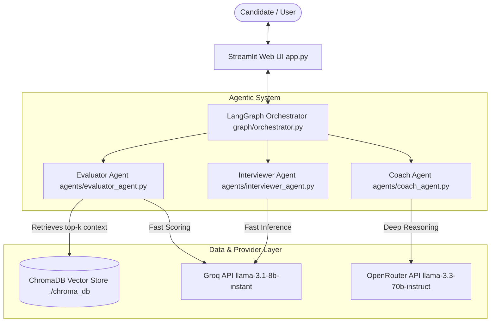

# Architecture Diagram

The system architecture for the **Interview Preparation Coach** multi-agent system is presented below.

### Component Description

1. **Streamlit UI (`app.py`)**: Provides interactive interview configuration, question cards, text area answer input, real-time feedback cards, and session progress tracking using `st.session_state`.
2. **LangGraph Orchestrator (`graph/orchestrator.py`)**: Manages state transitions, question count tracking, and multi-agent coordination.
3. **Interviewer Agent (`agents/interviewer_agent.py`)**: Dynamically generates role-tailored interview questions based on candidate preferences and conversation history.
4. **Evaluator Agent (`agents/evaluator_agent.py`)**: Queries ChromaDB vector database for knowledge base rubrics, then scores candidate responses across correctness, clarity, and completeness.
5. **Coach Agent (`agents/coach_agent.py`)**: Synthesizes evaluation metrics, RAG snippets, and user answers to generate structured coaching feedback (`✓ strengths`, `✗ gaps`, suggestions).
6. **Data & Provider Layer**:
   - **ChromaDB**: Local vector database storing embedded knowledge base chunks using `sentence-transformers/all-MiniLM-L6-v2`.
   - **Groq API**: High-throughput provider backing Interviewer and Evaluator agents.
   - **OpenRouter API**: Reasoning provider backing Coach Agent reflection.
