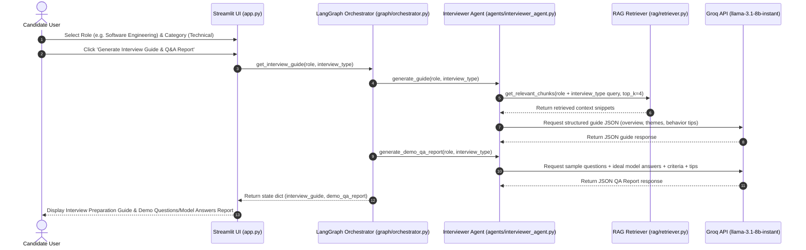

# Agent Communication Sequence Diagram

The sequence diagram below illustrates the message flow and retrieval-grounded generation sequence for the **Interview Preparation Guide** and **Demo Q&A Model Answers Report**.



### Shared State Schema

During guide & report generation, the `InterviewState` dictionary contains:

```python
{
    "role": "Software Engineering",
    "target_role": "Software Engineering",
    "interview_type": "Technical",
    "interview_guide": {
        "overview": "Detailed overview of the 45-60 min technical round...",
        "question_themes": ["Core OOP abstractions", "System performance", "Incident response"],
        "behavior_tips": ["Use STAR method", "Think aloud for technical logic", "Verify assumptions"]
    },
    "demo_qa_report": [
        {
            "question": "What is the difference between an abstract class and an interface?",
            "model_answer": "An abstract class represents an 'is-a' hierarchy with shared state...",
            "evaluation_criteria": "Single vs. multiple inheritance, state vs. contract...",
            "coaching_tips": "Compare Purpose, State, and Inheritance structured into 3 points."
        }
    ]
}
```
