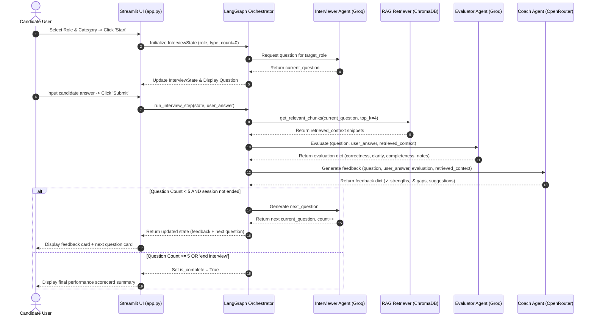

# Agent Communication Sequence Diagram

The sequence diagram below illustrates the message flow and shared state transitions across the multi-agent pipeline during a single interview turn.



### Shared State Lifecycle

At each step in the sequence, the shared `InterviewState` `TypedDict` object is enriched:

```python
{
    "interview_type": "Technical",
    "target_role": "Software Engineer",
    "current_question": "Explain abstract class vs interface.",
    "user_answer": "Abstract classes support single inheritance...",
    "retrieved_context": [{"text": "...", "source": "technical_prep.txt"}],
    "evaluation": {"correctness": "Good", "clarity": "Excellent", "completeness": "Good"},
    "feedback": {"strengths": ["✓ ..."], "gaps": ["✗ ..."], "suggestions": ["..."]},
    "question_count": 1,
    "is_complete": False
}
```
